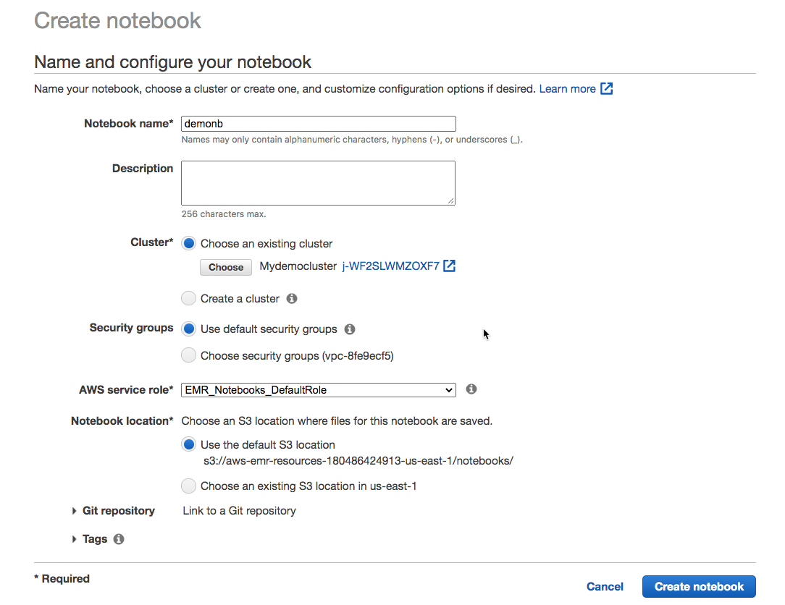

# Data Transformation Using Spark Sql and EMR Noteboo

In this lab you will learn how to use Amazon EMR notebook  and transform your dataset using spark sql.

### Validate S3 data sets

1. Login to your AWS console using the instructions provided by the lab instructor
2. Navigate to S3 --> glue-labs-001-<YourAccountNumber>-->Data
3. Click on nyc_trips_csv and see if there are 10 csv files. Feel free to explore the files.
4. Click on salesdb and see if there are 8 different folders such as customer, product, etc. Feel free to explore the files. You should see parquet files in each of the folders.

If you do not see the files in steps 3, 4 above, speak to your lab instructor.

## Section 1: Pre-Requisite to create a Glue Catalog for data sets in S3

This section assumes that the two data sets required for the lab are already loaded to S3. Use the steps below to validate the data set exists and complete this section.

### Create a Glue Catalog for the sales dataset 

#### Data set - Sales Data

1. Navigate to the AWS Glue console at Services -> AWS Glue

2. From the left-hand panel menu, navigate to Data Catalog -> Crawlers.

3. Click on the button ‘Add Crawler’ to create a new AWS Glue Crawler.

4. Fields to fill in:

    Page: Add information about your crawler: 
    Crawler name: salesdb_crawler

    Page: Add a data store: 
    Choose a data store: S3

    Include path: s3://glue-labs-001-YourAcctID/data/salesdb/

    Page: Choose an IAM role: 
    IAM Role: Choose an existing IAM role glue-labs-GlueServiceRole

    Page: Configure the crawler's output: 
    Database: Click on ‘Add database’ and enter database name as salesdb.

5. Click on the button ‘Finish’ to create the crawler.

6. Select the new Crawler and click on Run crawler to run the Crawler.

Now, verify whether both crawlers have run successfully and that you see 1 and 8 respectively under column named "Tables added"

### You have successfully completed the Pre-Requisites! Move on to the next section. 


## Section 2: Data Transformation using Amazon EMR  Notebook and Spark sql

In this section, you will use the data sets crawled under section 1 to create a denormed product tavle and also convert the format from the source csv for one of the data sets and write in parquet format.

## EMR notebook

1. In your AWS Console, navigate to EMR --> Notebooks (Left hand pane)
2. Click onm "Create Notebook" button to begin creating your notebook
3. Enter name "demonb" for the name of the notebook and select the EMR cluster pre-created for you. If you DO NOT see an EMR cluster, speak to your lab administrator. Leave rest defaults as seen in screenshot below and create notebook.



4. Wait until the status column for the notebook instance turns to "Ready" state. Keep refreshing until you see it (Typically takes <2 min).
5. Now, click "Open in Jupyter Lab".
6. Select "pyspark" under section named Notebook
5. Ensure "Create an IAM role" radio button is selected and give any name for the IAM role. Make a note of this IAM role name which will be used next.
6. Leave rest default and click create
7. Wait a few min and click refresh button at the top right corner of the page until you see the Status column turn to "Ready". Alternately, after waiting a few minutes, you can move on to step 8 below and see if the role name appears while you wait on status to turn to "Ready".

It can take roughly between 5 to 10 min to get to ready state. Once ready, select the checbox and hit "open notebook". 

8. This step is required to allow Sagemaker notebook to crate Glue jobs and workflows.

Using your AWS Console, navigate to IAM --> Roles and search for the IAM role you created in step 5. It should start with AWSGlueServiceSageMakerNotebookRole-. 
Click the role and add an inline policy as shown below. (We will create two inline policies)


Click on the JSON tab and paste the text below. Click Review policy and give it any name in next screen and click create policy.

#### Inline policy 1

``` 
{
    "Version": "2012-10-17",
    "Statement": [
        {
            "Effect": "Allow",
            "Action": "iam:PassRole",
            "Resource": "*",
            "Condition": {
                "StringEquals": {
                    "iam:PassedToService": "glue.amazonaws.com"
                }
            }
        }
    ]
} 
```


#### Inline Policy 2

Add following to another inline policy and name it inlinepolicy2
```
{
    "Version": "2012-10-17",
    "Statement": [
        {
            "Sid": "VisualEditor0",
            "Effect": "Allow",
            "Action": [
                "glue:CreateJob",
                "glue:CreateTrigger",
                "glue:CreateWorkflow"
            ],
            "Resource": "*"
        }
    ]
}
```

### Now your env is all ready to run notebook code!

## Execute your notebook code for data preparation activity

1. Download the ipynb file using the link provided here. 
[Click this link](https://emp-cf-templates-us-west-2.s3.us-west-2.amazonaws.com/gluelab/glue-dataprep.ipynb)

2. Once your jupyter notebook opens up, click on "open JupyterLab" at the top right of the page as seen in screenshot below.


3. It will open jupyter lab. Now select the upload file button as seen in screenshot below and upload the file you downloaded above. 


4. Follow the instructions on the notebook and complete the exercise. 
5. Once you successfully completed the notebook steps, you will see a glue workflow as seen in screenshot below. Navigate in your AWS console to AWS Glue --> Workflow (Under ETL) --> click on the workflow you see. 

Now, you can select it and click "run" under Actions drop down. This will run your notebook without you having to open the notebook going forward. Similarly, you can schedule this on a day to day basis for incremental data processing.


## Congratulations!!! You have successfully completed this lab
